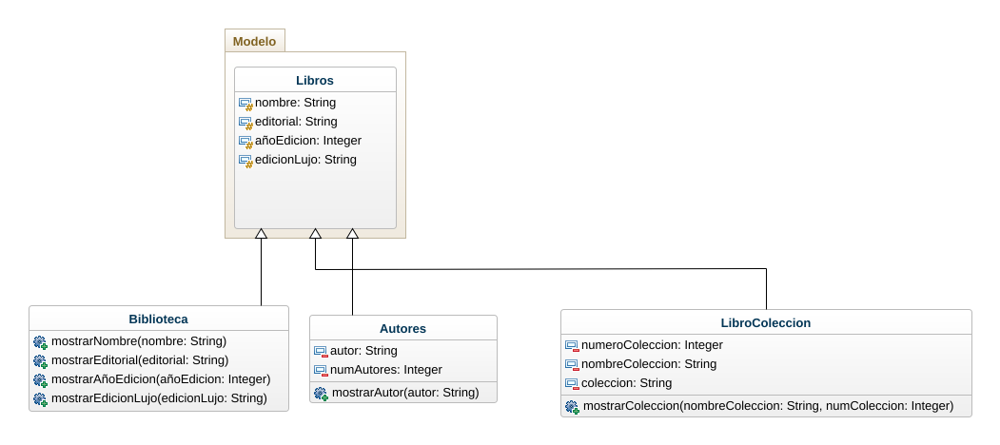
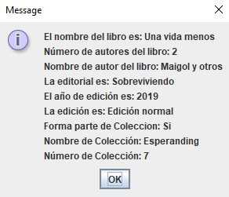

# EjercicioLibros
Cree una clase ejecutable a partir de la cual pueda hacer pruebas mediante la consola. (incluya pantallazos en el REDAME del repositorio)  2. Usando el patrón MVC, implemente una app que permita crear y gestionar libros de la biblioteca del Sr. Perez.

# Análisis
Identificación de clases, con sus respectivos atributos y métodos requeridos.

#Diagrama de clases

# Programa funcionando con el apartado de los autores +1
